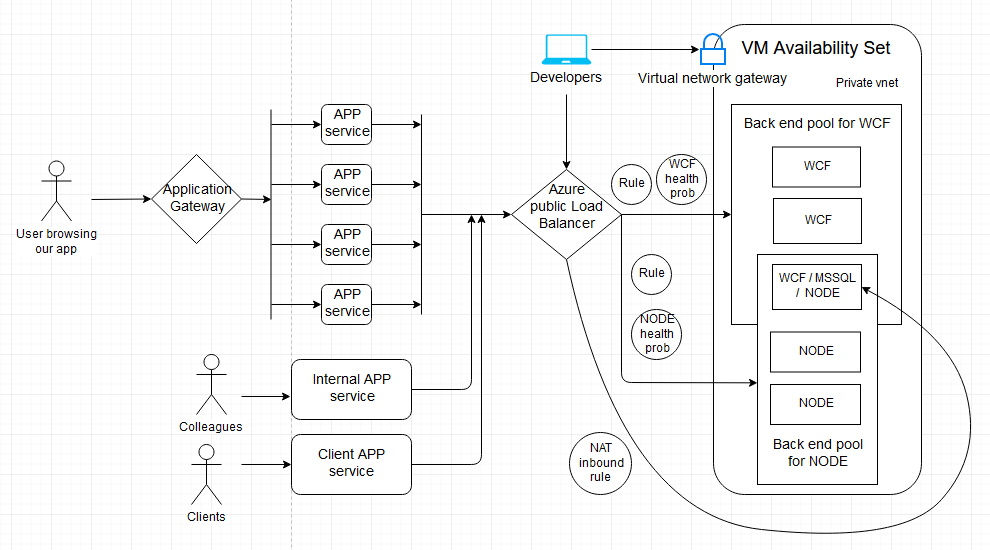

# Azure-Iaas-Paas
The idea here is to setup a multi-tier solution in Azure. The setup is over engineered with the intention to explore possibilities.

## TODO
1. Upload the ARM templates with parameters and veriables.
2. Add a simple WCF project, Node API, and App project.
3. Deploy all three projects.
4. Document the loadBalancer rules (backend pools, health probs, persistancy).
5. Describe the NAT rule for one of the VMs (remote MSSQL connection). This VM contains a MSSQL server, a NODE API project, and a WCF project. THIS IS NOT FOR PRODUCTION SETUP. This is just to show you that, it is possible to share a VM accross different backend pools and even accept inbound connection using NAT.
5. Document the setup for Application gateway.
6. Document the setup for Traffic manager (performance based routing).
7. Explain the overall flow.

