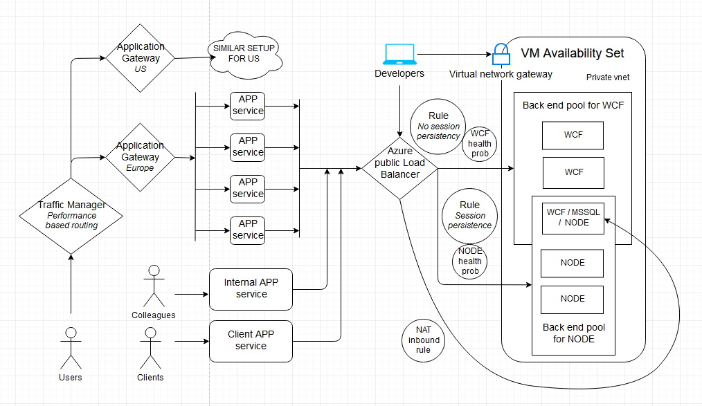

# Azure-Sample-Iaas-Paas
The idea here is to setup a multi-tier solution in Azure. The setup is over engineered with the intention to explore possibilities.

# TODO
1. Upload the ARM templates with veriables.
2. Add dummy WCF project and a simple App.
3. Document all the loadBalancer rules and NAT rule. 
4. Document the setup for Application gateway.
5. Explain the overall flow.

